# Glyf1

An F1 companion for Nothing phones with a **Glyph Matrix** (Phone 3, Phone
(4a) Pro). It lives on the back and on your home screen — no app icon, no
account, no API keys — showing the next Grand Prix session, a live countdown,
the current leader, and championship standings.

> Unofficial, fan-made, non-commercial. Not affiliated with Nothing or
> Formula 1. See [`NOTICE.md`](NOTICE.md).

## The three surfaces

Glyf1 is deliberately **app-less** — there is no launcher icon. Everything
happens through:

- **Glyph Matrix toy** — the rear matrix shows the current F1 face.
- **Home-screen widget** — schedule, countdown and leader on the front.
  Tap it to refresh.
- **Quick Settings tile** — toggles the automatic matrix takeover during
  live sessions.

## Glyph Matrix faces

The 4a Pro matrix is a circular 13×13 grid, so text uses a hand-built 3×5
pixel font. The face changes with the session state:

| Race week | Hours out | Minutes out |
|:---:|:---:|:---:|
|  |  | 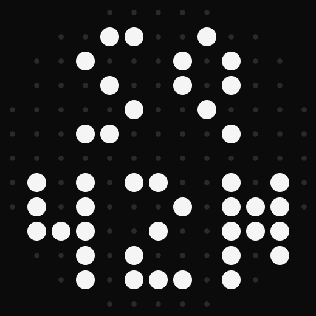 |
| Session code + days | Code + hours | Code + minutes |

| Live session | Result | Standings |
|:---:|:---:|:---:|
|  |  |  |
| Spinning wheel | Winner + session | WDC leader + points |

Matrix images are simulations generated by
[`tools/render_matrix.py`](tools/render_matrix.py) from the app's own
`PixelFont` / `MatrixRenderer` logic — the physical rear LEDs can't be
screen-captured. Regenerate with `python3 tools/render_matrix.py`.

## Home-screen widget

Two sizes, each with three states — before a session (event / session / start
time + standings), during it (`LIVE` + dot-matrix car art), and after
(`FINISHED` + winner).

The timer counts down during the final ten minutes. Background updates are
best-effort and may be delayed by Android battery management. Results expire
at midnight UTC and give way to a later live session. Bitmap panels include
text descriptions for screen readers.

**Wide (4×2):**

| Upcoming | Live | Finished |
|:---:|:---:|:---:|
| 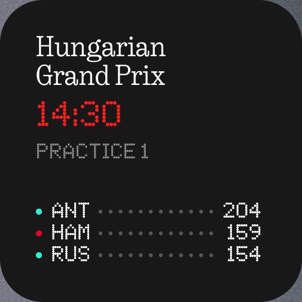 | 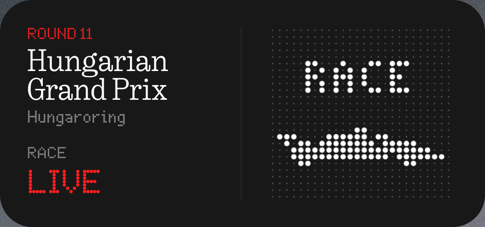 | 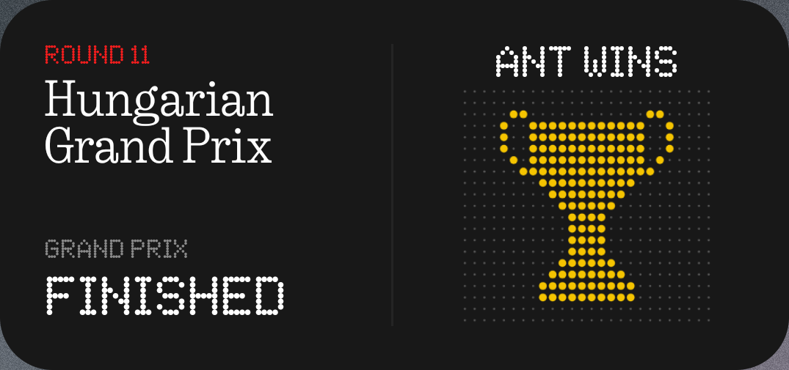 |

**Compact (2×2):**

| Upcoming | Live | Finished |
|:---:|:---:|:---:|
| 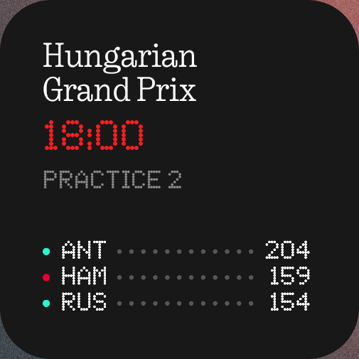 | 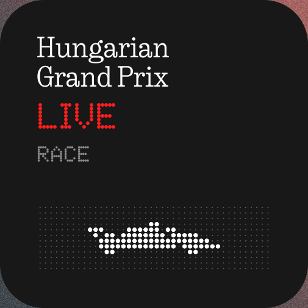 | 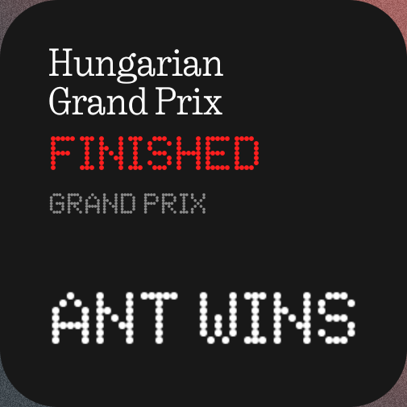 |

The bitmap text and dot-matrix art follow the system theme — here the wide
widget in **light mode**:

| Upcoming | Live | Finished |
|:---:|:---:|:---:|
| 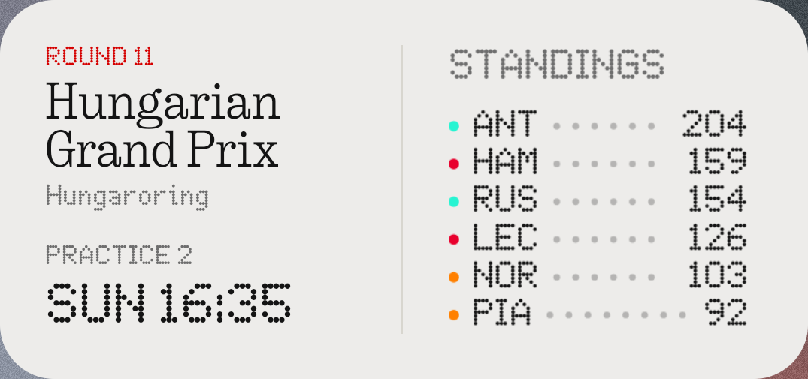 | 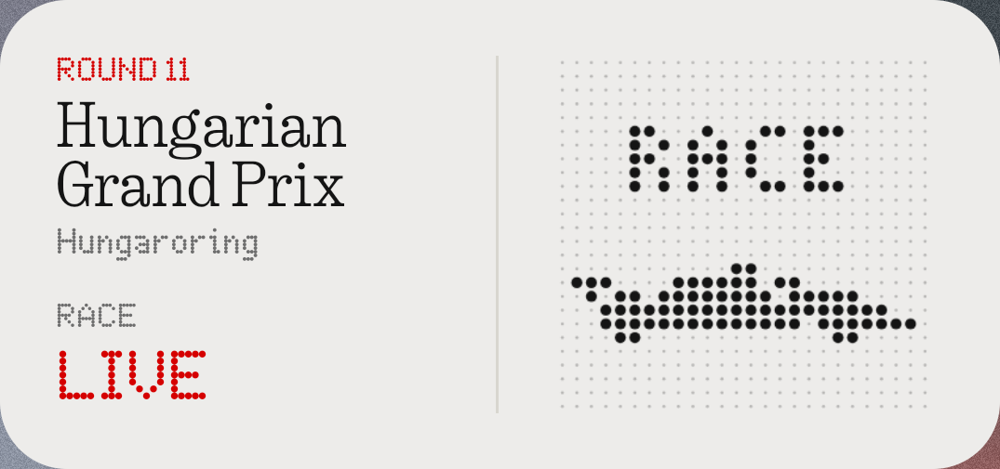 | 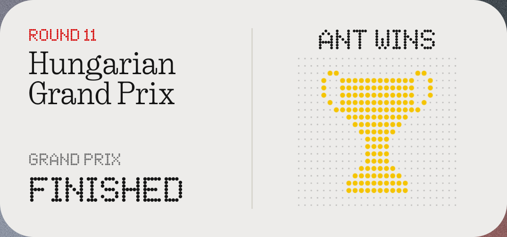 |

Before the first data fetch (or if the schedule can't be loaded) the widget
shows a **no-data** fallback — `NO DATA` with dot-matrix art:

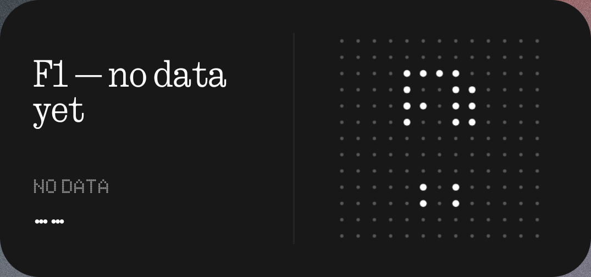

## Build & install

You need Android Studio (or the Android SDK + JDK 17) and a Nothing phone
with a Glyph Matrix.

1. **Get the Glyph Matrix SDK** (not bundled — Nothing's licence forbids
   redistributing it). Download `glyph-matrix-sdk-2.0.aar` from
   [Nothing's kit](https://github.com/Nothing-Developer-Programme/GlyphMatrix-Developer-Kit)
   and save it as `app/libs/GlyphMatrixSDK.aar`. See
   [`app/libs/README.md`](app/libs/README.md).

2. **Build & sideload:**

       ./gradlew assembleDebug
       adb install app/build/outputs/apk/debug/app-debug.apk
       # enable Glyph developer mode (expires after 48h):
       adb shell settings put global nt_glyph_interface_debug_enable 1

3. **Set it up on the phone** (there is no app to open):
   - Long-press home → *Widgets* → **Glyf1 Widget**.
   - *Settings → Glyph Interface → Glyph Toys* → add **Glyf1**.
   - Optionally edit the Quick Settings panel to add the **Glyf1** tile.

### Signed release build

Copy `keystore.properties.example` to `keystore.properties`, generate a
keystore, and fill it in:

    keytool -genkey -v -keystore glyf1-release.jks \
      -keyalg RSA -keysize 2048 -validity 10000 -alias glyf1
    ./gradlew assembleRelease
    # → app/build/outputs/apk/release/app-release.apk

`keystore.properties` and `*.jks` are gitignored — never commit them.

## How it works

`WorkManager` (`RefreshWorker`, every 30 min, plus `LiveMatrixWorker` while live) →
`DataStore` cache (`WidgetStateCache`) → both the widget (`F1WidgetProvider`,
all text rendered as Ndot/NType bitmaps) and the toy (`F1GlyphToyService`)
render from cache. `MatrixRenderer` + `PixelFont` turn short strings into the
13×13 dot-matrix face. During live windows the QS tile lets the app hold the
matrix via `setAppMatrixFrame`.

**Data:** schedule, championship standings, race winners and qualifying
results from [Jolpica](https://jolpi.ca). Live status is estimated from the
session schedule; this build does not fetch live positions or lap timing.
A failed schedule request keeps the cached weekend for the next retry.

Design notes and the build plan live in `docs/superpowers/`.

## Licence

Project code is [MIT](LICENSE). Third-party components (the Nothing SDK,
fonts, F1/Nothing trademarks, data sources) are **not** — see
[`NOTICE.md`](NOTICE.md).
